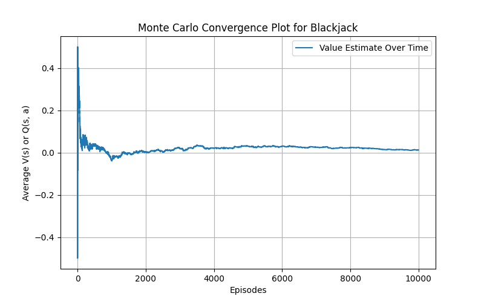

# 🏆 Reinforcement Learning: Monte Carlo & SARSA

This project implements **Monte Carlo Policy Evaluation** for **Blackjack** and **SARSA (On-Policy TD Control)** for **Cliff Walking**. Both algorithms learn to optimize their respective policies through reinforcement learning.

## 🚀 Implemented Algorithms

- **Monte Carlo (MC) for Blackjack**  
  - Evaluates a **fixed policy** using Monte Carlo methods.
  - Learns **state-value function \(V(s)\)** by averaging returns.
  - Uses **first-visit MC** for estimating \(V(s)\).
  - Implements a **"stick if sum ≥18, otherwise hit"** strategy.

- **SARSA for Cliff Walking**  
  - Learns an **optimal policy** using temporal difference (TD) learning.
  - Uses **ε-greedy exploration** to balance exploration and exploitation.
  - Avoids the cliff and optimizes its path towards the goal.

---

## 📊 Monte Carlo Results (Blackjack)

### 🔥 **State-Value Function for Blackjack**
Monte Carlo evaluates the expected return for each state, showing **high values for player sums of 20-21**, while lower sums result in **negative expected values**.


---

### 📈 **Convergence of Monte Carlo Learning**
The value function stabilizes after **1,000 episodes**, indicating that the policy has been well-estimated.



---

### 📉 **Cumulative Rewards Over Episodes (MC)**
Monte Carlo **cumulative rewards** show that the policy provides **consistent long-term returns**, validating its effectiveness.


---

## 📊 SARSA Results (Cliff Walking)

### 🔥 **Q-Value Heatmap for Cliff Walking**
The SARSA agent learns **higher Q-values towards the goal** and **avoids falling into the cliff (bottom row)**.


---

### 📈 **Convergence of SARSA Learning**
The agent’s Q-values **stabilize after 2,000 episodes**, demonstrating effective policy learning.


---

### 📉 **Cumulative Rewards Over Episodes (SARSA)**
SARSA **initially accumulates large negative rewards** due to falling into the cliff, but gradually **optimizes its path and reduces penalties** over time.


---

### 🏁 **Learned Policy Visualization (SARSA)**
The SARSA agent learns a **safe path to the goal**, using arrows to represent the optimal actions.


---

## 📦 Installation & Usage

1. Clone the repository:
   ```bash
   git clone https://github.com/rl_assignment_4
   cd rl_assignment_4
   pip install -r requirements.txt
   streamlit run app.py

